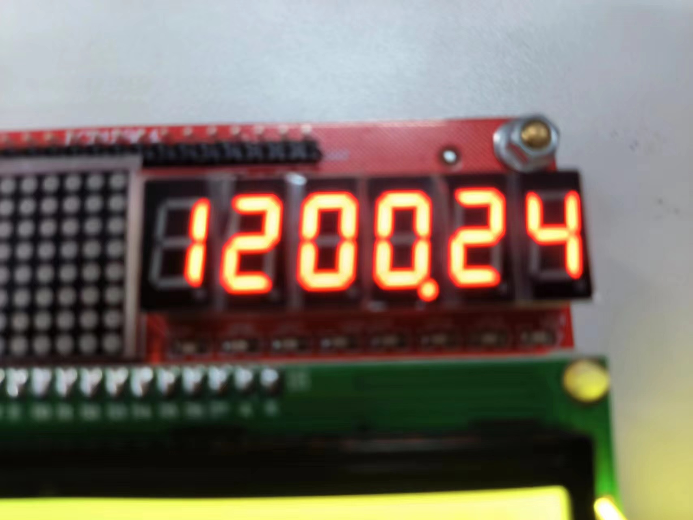

# 基于KingST-51MCU的简单篮球比赛计时器

## 前提

VScode和[EIDE插件](https://marketplace.visualstudio.com/items?itemName=CL.eide),并且配置好工具链，配置[教程](https://zhuanlan.zhihu.com/p/669952673)

## 适用

金沙滩 51单片机


## 开始

```powershell
git clone https://github.com/achieveil/KingST-51MCU-BasketTimer.git
cd KingST-51MCU-BasketTimer
code .
```

然后打开工作区

## 构建

自定义代码后构建，生成hex文件，项目中已存在

## 烧录到单片机

使用EIDE的烧录命令（需要配置），或者使用其他烧录软件

## 效果

1. 系统上电瞬间，6位数码管的高2位显示计时剩余分钟数，中间2位显示计时剩余秒数，低2位显示24秒计时剩余。低二位变为0会响
2. 按键K1来进行计时开启/暂停，设置按键K2来进行24秒回表。
3. 倒计时结束，LED小灯部分全亮，蜂鸣器蜂鸣，点阵全亮，示意比赛结束

模块连接

按键控制模块
设置按键K1来进行计时开启/暂停，设置按键K2来进行24秒回表。
基本原理：4条输人线接到单片机的I/O口上，当按下按键K1时,+5V依次通过电阻R1和按键K1最终进入GND形成一条通路，这条线路的全部电压都加到电阻R1上,引脚KeyIn1就是一个低电平。当松开按键后,线路断开,不会有电流通过，KeyIn1和+5V应该是等电位，是一个高电平。因此，可以通过引脚KeyIn1这个I/O口的高低电平来判断是否有按键按下。

## 本项目的初衷

纪念这一时刻

## end
